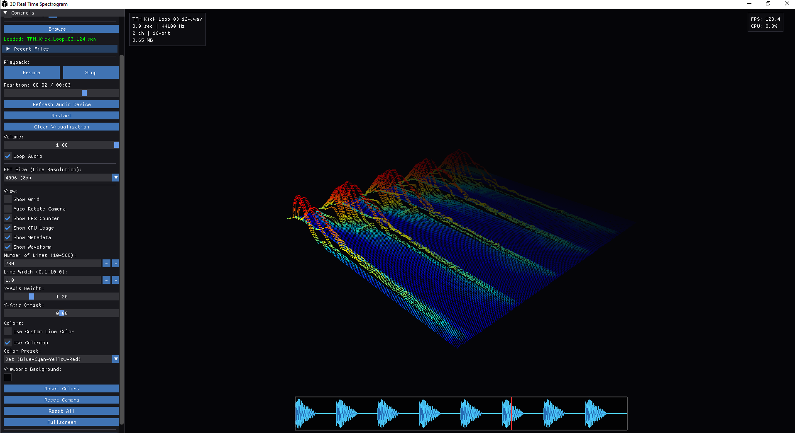

# 3D Waterfall Spectrogram Viewer

A real-time audio spectrogram visualization tool with both 2D and 3D waterfall displays, built with OpenGL and ImGui.

 <!-- Add a screenshot when available -->

## Features

- **Real-time Audio Analysis**: Capture and visualize audio from your microphone or audio files
- **Dual Display Modes**: 
  - 2D texture-based spectrogram (optimized for performance)
  - 3D waterfall visualization
- **Multiple Color Schemes**: 8 different color palettes including Rainbow, Thermal, Grayscale, and more
- **Adjustable Parameters**:
  - FFT size (512 to 16384)
  - Frequency range
  - Color intensity
  - History depth for waterfall
- **Audio File Support**: Load and analyze WAV, FLAC, OGG, and other audio formats
- **Performance Monitoring**: Real-time CPU and memory usage display

## Prerequisites

### Windows (MSYS2/MinGW)

Install MSYS2 from [https://www.msys2.org/](https://www.msys2.org/), then install dependencies:

```bash
pacman -S mingw-w64-x86_64-gcc mingw-w64-x86_64-glew mingw-w64-x86_64-glfw \
          mingw-w64-x86_64-portaudio mingw-w64-x86_64-fftw \
          mingw-w64-x86_64-libsndfile git
```

### Linux (Ubuntu/Debian)

```bash
sudo apt-get install build-essential libglew-dev libglfw3-dev libportaudio2 \
                     portaudio19-dev libfftw3-dev libsndfile1-dev git
```

### macOS

```bash
brew install glew glfw portaudio fftw libsndfile
```

## Building

### 1. Clone ImGui

First, download ImGui (required dependency):

```bash
git clone https://github.com/ocornut/imgui.git
```

### 2. Compile Resource File (Windows only)

```bash
windres app.rc -o app.o
```

### 3. Compile the Project

**Windows (MSYS2/MinGW):**

```bash
g++ -o spectrogram_gui.exe spectrogram_lines.cpp \
app.o imgui/imgui.cpp imgui/imgui_draw.cpp imgui/imgui_tables.cpp imgui/imgui_widgets.cpp \
imgui/backends/imgui_impl_glfw.cpp imgui/backends/imgui_impl_opengl3.cpp -I./imgui -I./imgui/backends \
-DGLEW_STATIC -mwindows -static -static-libgcc -static-libstdc++ -lglew32 -lglfw3 -lopengl32 -lportaudio \
-lfftw3 -lsndfile -lvorbisenc -lvorbisfile -lvorbis -lFLAC -lmp3lame -lmpg123 -lopus -logg -lgdi32 \
-lwinmm -lole32 -lcomdlg32 -lsetupapi -lksuser -lpsapi -lshlwapi -std=c++11 -O2
```

**Linux:**

```bash
g++ -o spectrogram_gui spectrogram_lines.cpp \
imgui/imgui.cpp imgui/imgui_draw.cpp imgui/imgui_tables.cpp imgui/imgui_widgets.cpp \
imgui/backends/imgui_impl_glfw.cpp imgui/backends/imgui_impl_opengl3.cpp -I./imgui -I./imgui/backends \
-lGLEW -lglfw -lGL -lportaudio -lfftw3 -lsndfile -lpthread -ldl -std=c++11 -O2
```

**macOS:**

```bash
g++ -o spectrogram_gui spectrogram_lines.cpp \
imgui/imgui.cpp imgui/imgui_draw.cpp imgui/imgui_tables.cpp imgui/imgui_widgets.cpp \
imgui/backends/imgui_impl_glfw.cpp imgui/backends/imgui_impl_opengl3.cpp -I./imgui -I./imgui/backends \
-I/opt/homebrew/include -L/opt/homebrew/lib \
-lGLEW -lglfw -framework OpenGL -lportaudio -lfftw3 -lsndfile -std=c++11 -O2
```

## Usage

1. **Launch the Application**:
   ```bash
   ./spectrogram_gui.exe  # Windows
   ./spectrogram_gui      # Linux/macOS
   ```

2. **Start Audio Capture**: Click "Start Audio" to begin real-time analysis from your default microphone

3. **Load Audio Files**: Click "Load Audio File" to analyze pre-recorded audio

4. **Adjust Parameters**:
   - Toggle between 2D and 3D views
   - Change color schemes
   - Adjust FFT size for frequency resolution vs. time resolution trade-off
   - Modify display range and intensity

## Project Structure

```
.
├── spectrogram_lines.cpp   # Main application source
├── stb_image.h             # Image loading library (for icon)
├── app.rc                  # Windows resource file
├── app.res                 # Compiled resource (generated)
├── app.o                   # Compiled resource object (generated)
├── resource.h              # Resource header
├── icon2.ico               # Application icon
├── imgui.ini               # ImGui settings (auto-generated)
├── imgui/                  # ImGui library (git submodule recommended)
└── README.md               # This file
```

## Dependencies

- **GLEW**: OpenGL Extension Wrangler Library
- **GLFW**: Window and input handling
- **PortAudio**: Cross-platform audio I/O
- **FFTW3**: Fast Fourier Transform library
- **libsndfile**: Audio file I/O
- **ImGui**: Immediate mode GUI library
- **stb_image.h**: Single-header image loading library

## Performance Notes

The application includes several optimizations:
- Texture-based 2D spectrogram rendering (10-50x faster than line-based)
- Reduced texture size for large viewports
- Efficient memory management for audio buffers
- Real-time performance monitoring

## License

<!-- Add your chosen license here, e.g., MIT, GPL, etc. -->

## Contributing

Contributions are welcome! Please feel free to submit a Pull Request.

## Known Issues

- Large FFT sizes (16384) may cause performance issues on slower systems
- 3D waterfall view is more CPU-intensive than 2D view

## Credits

- Built with [ImGui](https://github.com/ocornut/imgui)
- Uses [stb_image.h](https://github.com/nothings/stb) for image loading
